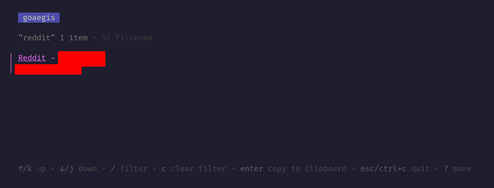

<h1 align="center">CLI to generate <a href="https://en.wikipedia.org/wiki/One-time_password">OTPs</a> from <a href="https://getaegis.app/">Aegis</a> <a href="https://github.com/beemdevelopment/Aegis/blob/master/docs/vault.md">vault file</a></h1>

<div align="center">

[](https://gitea.dwysokinski.me/Kichiyaki/goaegis/releases)
[](#license)
[](https://goreportcard.com/report/gitea.dwysokinski.me/Kichiyaki/goaegis)
[](https://woodpecker.dwysokinski.me/repos/19)

</div>

<p align="center">
    <a href="mailto:contact@dwysokinski.me">Report Bug</a>
    ·
    <a href="mailto:contact@dwysokinski.me">Request Feature</a>
</p>



## Installation

### Linux/Windows
You can download prebuilt binaries from [this page](https://gitea.dwysokinski.me/Kichiyaki/goaegis/releases).

### go install

You can also install this CLI via go install. Go **1.22+** is required to do so.
```shell
go install gitea.dwysokinski.me/Kichiyaki/goaegis/cmd/goaegis@latest
```

### Shell Completion

#### bash

Add the following to the end of ``~/.bashrc``:
```shell
source <(goaegis hook bash)
```

## License

This project is licensed under the MIT license. See the [LICENSE](LICENSE) file for the full license text.
